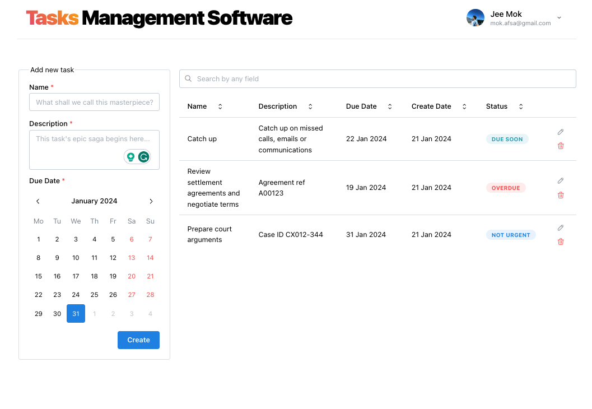

# Task Management Software



This project is designed to streamline the management of tasks, allowing users to view, edit, or delete tasks efficiently. With its intuitive table list view, users can effortlessly search tasks across any field and sort them by due date or creation date, ensuring a smooth task management experience.

## Clarifications

### Git strategy

This project currently contains a single commit, a practice not intended for production environments.

### Traffic Suitability

Leveraging serverless architecture with DynamoDB and Lambda, the system auto-scales according to traffic demands, ensuring robust performance regardless of load.

### Risks: Database Flexibility Trade-off

While DynamoDB excels in performance, it comes with a trade-off in flexibility compared to structured relational databases. Its design necessitates a well-defined access pattern, making it less adaptable to changes in database structure or querying requirements. This inflexibility could pose challenges if future modifications to the data model or access patterns are required.

### Feature Implementation: Sorting and Searching

Ideally, sorting and searching should be implemented at the database level to optimize performance and handle pagination efficiently. Currently, these features are implemented in the frontend due to time constraints.

### Planned Improvements

- Implement debounce for table search to enhance performance.
- Refactor authentication to use session cookies in the frontend.
- Transition environment variables to [SST configurations](https://docs.sst.dev/config).
- Implement stage deployment for production.
- Integrate CI/CD using [SEED](https://seed.run/docs/iam-credentials-per-stage).
- Enhance testing and linting processes.
- Optimize NextJS component loading.
- Implement subdomain for API.
- Optimize for mobile devices.
- Improve error handling in frontend and backend.
- Implement schema validation in the backend.
- Use [asdf](https://asdf-vm.com/guide/getting-started.html) for runtime version management.

## Database Design

| #   | PK            | SK            | Data                 | GSI 1 PK                |
| --- | ------------- | ------------- | -------------------- | ----------------------- |
| 1   | USER#{userId} | PROFILE       | ...user profile data | GOOGLE#{externalUserId} |
| 2   | USER#{userId} | TASK#{taskId} | ...task data         |                         |

This design supports the 'one-user-many-tasks' model, addressing all required access patterns effectively.

## Technology Stack

- Frontend: NextJS - A React framework for building user interfaces.
- UI: Mantine - A modern UI library for React.
- Backend: ExpressJS - A web application framework for Node.js.
- Database: DynamoDB - A NoSQL database service. [Motivation for using DynamoDB](https://aws.amazon.com/blogs/database/motivations-for-migration-to-amazon-dynamodb).
- Serverless: SST - Simplifies serverless application development. [About SST](https://sst.dev/chapters/what-is-sst.html) and [why serverless](https://sst.dev/chapters/why-create-serverless-apps.html).
- Authentication: Google OIDC Single Sign-On. [Overview of Google OIDC](https://docs.sst.dev/auth#google).

## Folder structure

Inspired by: [NextJS 13 Folder Structure](https://medium.com/@mertenercan/nextjs-13-folder-structure-c3453d780366)

## Prerequisites

Node.js (version 18 or later) and npm (version 7 or later). [Download Node.js](https://nodejs.org/en)

## Setup Instructions

### 1. AWS Setup (First Time Only)

- Create an AWS account and configure your local environment. [AWS IAM User Guide](https://sst.dev/chapters/create-an-iam-user.html) and [AWS CLI Configuration Guide](https://sst.dev/chapters/configure-the-aws-cli.html).
- For CLI with MFA, follow this [MFA Authentication Guide](https://aws.amazon.com/premiumsupport/knowledge-center/authenticate-mfa-cli).

### 2. Start SST

```sh
npm install # Install dependencies
npm run dev
```

Your backend public URL will be displayed after deployment:

```sh
✔  Deployed:
   StorageStack
   AppStack
   ApiEndpoint: https://xxxx.ap-southeast-1.amazonaws.com
```

### 3. OIDC Auth Setup (First Time Only)

- Create a Google SSO client ID and authorize your backend URL. [Google SSO Guide](https://sst.dev/examples/how-to-add-google-login-to-your-sst-apps.html).
- Update the `GOOGLE_CLIENT_ID` in `/stacks/AppStack.ts`.

### 4. Start Frontend

```sh
cd packages/web
npm run dev
```

## Clean up

```sh
npm run remove
```
